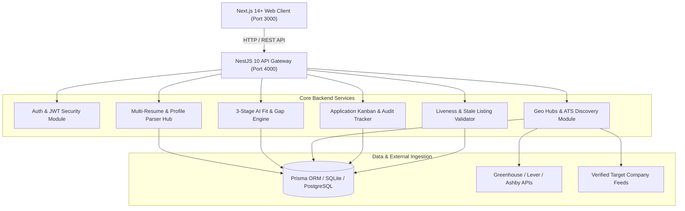
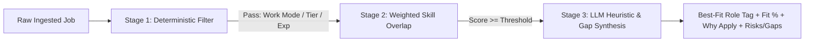

# 🏛️ JobAnalytica System Architecture & Engineering Design

JobAnalytica is built as a high-throughput, modular monorepo designed for autonomous regional job ingestion, multi-resume candidate profiling, and multi-tier match scoring.

---

## 1. High-Level Monorepo Architecture

---

## 2. Core Subsystems

### A. Multi-Resume & Multi-Role Profiling Subsystem
- **Candidate Profiles**: Users can upload and maintain multiple distinct resumes (e.g. *Founding AI Engineer*, *Staff Backend Engineer*, *Engineering Manager*).
- **PDF Extraction**: Multi-mode parsing extracts text, skills, experiences, and education.
- **Primary / Default Toggle**: Allows one resume to act as the primary anchor while all other resumes remain active for background scoring.

### B. Regional Geo & Tech Hub Discovery Subsystem
- **Top 10 Indian Tech Hubs**: Deep geo-cataloging across Bengaluru, Hyderabad, Pune, Delhi-NCR, Chennai, Mumbai, Ahmedabad/GIFT City, Kochi, Kolkata, and Jaipur/Indore.
- **Multi-Tier Company Directory**: Cataloged 50–100+ target employers across:
  - 🚀 **Early-Stage Startups (Seed / Series A)**
  - 🏢 **Mid-Cap / Growth Scaleups**
  - 🏛️ **Tier 1 Enterprises & Unicorns**
  - 🌐 **Tier 3 IT & Services Consultancies**
- **ATS Direct Resolvers**: Public JSON endpoints from Greenhouse, Lever, and Ashby queried with zero bot blocking and instant structured payload conversion.
- **Liveness & Freshness Validator**: Periodic HEAD requests verify career page URLs; listings older than 45 days or returning 404/410 status codes are automatically deactivated.

### C. 3-Stage AI Matching Funnel

1. **Stage 1 (Deterministic Filter)**: Evaluates location constraints, work mode compatibility, and baseline minimum experience.
2. **Stage 2 (Weighted Skill Overlap)**: Calculates token-level intersection and semantic skill clustering between the candidate's parsed profile and JD requirements.
3. **Stage 3 (Synthesis & Gap Analysis)**: Generates human-readable "Why You Should Apply" bullets and identifies critical missing gaps or potential career risks.

### D. Application Kanban & Audit Tracker
- State machine managing transitions: `SAVED` → `APPLIED` → `ASSESSMENT` → `INTERVIEW` → `OFFER` (or `REJECTED`).
- Event sourcing audit log recording timestamped status changes and interview notes.
- Streaming CSV export utility with HTTP streaming for high efficiency.

---

## 3. Database Schema Overview (Prisma)

- **`User`**: Account authentication, credentials, email, timestamps.
- **`Resume`**: Raw uploaded file metadata, storage paths, parsing status, and role label.
- **`CandidateProfile`**: Normalized structured profile extracted from resume (skills, experience, education, preferred roles).
- **`JobSource`**: Metadata about job sources and ATS endpoints.
- **`CanonicalJob`**: Deduplicated canonical job entities with salary ranges, tier classification, required skills, and liveness flags (`isActive`).
- **`SourcePosting`**: Multi-source references linking external postings to a canonical job.
- **`JobMatch`**: Computed match scores per user and resume profile, including priority scores, skill scores, `matchedProfileLabel`, and `alternateProfiles` breakdown.
- **`Application`**: Application status records linked to candidate jobs, with status history logs.
